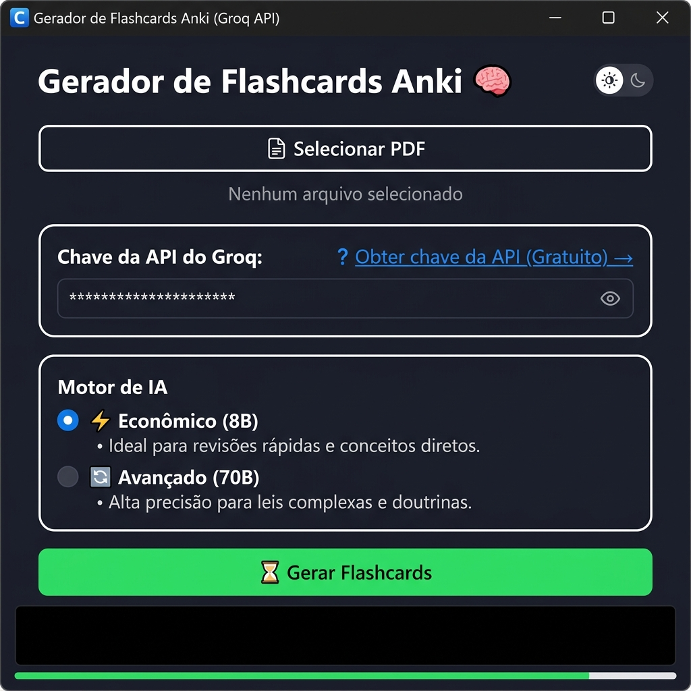

# Gerador de Flashcards Anki com IA 🧠⚡

Transforme qualquer PDF em flashcards prontos para o **Anki** — em segundos, usando Inteligência Artificial gratuita.

> **Não sabe o que é o Anki?** É um aplicativo gratuito de flashcards que usa repetição espaçada para te ajudar a memorizar conteúdo de forma eficiente. [Saiba mais em ankiweb.net](https://apps.ankiweb.net/).

---

## 📸 Como o app parece



---

## 🗂️ Escolha o seu perfil

> Antes de tudo, decida qual das duas opções abaixo é a sua:

| Perfil | Descrição | Vá para |
|---|---|---|
| 👤 **Usuário comum** | Quer apenas usar o app, sem instalar Python ou qualquer coisa técnica | [Opção A — Baixar o Executável](#-opção-a--para-usuários-comuns-baixar-o-executável-windows) |
| 🛠️ **Desenvolvedor** | Quer rodar o código-fonte, modificar ou contribuir com o projeto | [Opção B — Rodar pelo Código-Fonte](#-opção-b--para-desenvolvedores-rodar-pelo-código-fonte) |

---

## 🔑 Passo 0 — Obtenha sua Chave Gratuita do Groq (obrigatório para ambos os perfis)

O app usa a IA do Groq para gerar os flashcards. Você precisa de uma **chave de API gratuita**. Não é necessário cartão de crédito.

| Passo | O que fazer |
|---|---|
| **1** | Acesse **[console.groq.com](https://console.groq.com)** e crie uma conta (pode usar o Google) |
| **2** | No menu lateral esquerdo, clique em **"API Keys"** |
| **3** | Clique em **"Create API Key"**, dê um nome qualquer (ex: `meu-app`) e clique em **"Submit"** |
| **4** | Copie a chave gerada — ela começa com **`gsk_`** |
| **5** | Guarde essa chave em algum lugar seguro (bloco de notas, por exemplo) |

> ✅ A chave é **gratuita** e tem um limite generoso de uso mensal, mais que suficiente para estudos.

> 🔒 A chave fica salva **apenas no seu computador** (nunca enviada a nenhum servidor além do próprio Groq).

---

## 👤 Opção A — Para usuários comuns: Baixar o Executável (Windows)

> **Não precisa instalar Python, Git, nem nada técnico.** Basta baixar um único arquivo e abrir.

### O que você vai precisar

- ✅ **Windows 10 ou 11** (64-bit)
- ✅ **Chave da API do Groq** (gratuita — veja o Passo 0 acima)
- ✅ **Anki instalado** no computador para importar os flashcards — [baixar aqui](https://apps.ankiweb.net/)
- ✅ **Conexão com a internet** (para o app se comunicar com a IA do Groq)

### Como baixar e instalar

1. Acesse a seção **[Releases](../../releases/latest)** deste repositório (botão no menu lateral direito do GitHub).
2. Baixe o arquivo **`GeradorFlashcardsAnki.exe`** da versão mais recente.
3. Salve em qualquer pasta do seu computador (ex: Área de Trabalho).
4. Dê **duplo clique** no arquivo `.exe` para abrir o aplicativo.

> ⚠️ **Aviso do Windows Defender:** É normal aparecer um alerta de "aplicativo desconhecido" na primeira vez que você abre, porque o executável não possui uma assinatura digital paga. Para prosseguir:
> 1. Clique em **"Mais informações"**
> 2. Clique em **"Executar assim mesmo"**

---

### Como usar o app (guia visual)

Veja na imagem da tela principal o que cada elemento faz:

#### 1️⃣ Selecionar o PDF

Clique no botão **"Selecionar PDF"** (o maior botão no topo, com borda branca) e escolha o arquivo PDF do seu material de estudo. Após selecionar, o **nome do arquivo** aparece logo abaixo do botão como confirmação.

> 💡 O app funciona com PDFs **digitais** (texto selecionável). PDFs de foto/escaneamento não funcionam diretamente — nesse caso, use um serviço OCR online antes de importar.

#### 2️⃣ Inserir a Chave da API do Groq

No painel **"Chave da API do Groq"**, cole a chave que você obteve no Passo 0 (começa com `gsk_`). Os caracteres aparecem como `***` por segurança — clique no ícone de olho 👁️ à direita para ver o que foi digitado.

> ✅ **A chave é salva automaticamente!** Após o primeiro uso bem-sucedido, o app lembra da sua chave para sempre. Você não precisará colá-la de novo.

> Não tem a chave ainda? Clique no link azul **"Obter chave da API (Gratuito) →"** dentro do painel — ele abre o site do Groq diretamente.

#### 3️⃣ Escolher o Motor de IA

No painel **"Motor de IA"**, selecione um dos dois modelos:

| Opção | Quando usar |
|---|---|
| ⚡ **Econômico (8B)** | Ideal para a maioria dos casos — mais rápido, ótimo para conceitos diretos e revisões |
| 🔄 **Avançado (70B)** | Use para conteúdos mais densos, como legislação complexa, doutrinas e textos longos |

> Para a maioria dos usuários, o **Econômico** já é suficiente e muito mais rápido.

#### 4️⃣ Gerar os Flashcards

Clique no botão verde **"Gerar Flashcards"**. O app irá:
- Extrair o texto do PDF
- Enviar para a IA do Groq em blocos
- Formatar as respostas como pares Pergunta/Resposta
- Criar o arquivo `.apkg` pronto para o Anki

Acompanhe o progresso na **barra verde** na parte inferior da tela e nas mensagens de log que aparecem na **área preta** abaixo do botão.

> ⏱️ PDFs grandes podem levar alguns minutos. O app mostra o tempo estimado restante durante o processamento.

#### 5️⃣ Onde fica o arquivo gerado?

Quando concluído, **dois arquivos** são salvos automaticamente na sua **pasta Downloads** (`C:\Users\SeuNome\Downloads`):

| Arquivo | O que é |
|---|---|
| `NomeDoArquivo_Flashcards.apkg` | O baralho pronto para importar no Anki |
| `NomeDoArquivo_Relatorio.txt` | Todos os flashcards em texto simples, para revisão rápida |

#### 6️⃣ Importar no Anki

1. Abra o **Anki** no seu computador.
2. **Dê duplo clique** no arquivo `.apkg` gerado — ele abre no Anki automaticamente.
3. O baralho aparece na sua lista de decks, pronto para estudar! ✅

---

## 🛠️ Opção B — Para desenvolvedores: Rodar pelo Código-Fonte

> Esta opção funciona em **Windows, macOS e Linux**.

### O que você vai precisar instalar

| Ferramenta | Versão mínima | Download |
|---|---|---|
| **Python** | 3.10 ou superior | [python.org/downloads](https://www.python.org/downloads/) |
| **Git** | Qualquer versão recente | [git-scm.com](https://git-scm.com/) |
| **Anki** | Qualquer versão recente | [apps.ankiweb.net](https://apps.ankiweb.net/) |
| **Chave da API do Groq** | — | [console.groq.com](https://console.groq.com) (gratuita) |

> ⚠️ **Importante (Windows):** Durante a instalação do Python, marque a opção **"Add Python to PATH"** antes de clicar em *Install Now*.

### Passo a passo

#### 1. Clone o repositório

Abra o **Terminal** (PowerShell no Windows, Terminal no macOS/Linux) e execute:

```bash
git clone https://github.com/vits56/gerador-flashcards.git
cd gerador-flashcards
```

> **Sem Git?** Clique no botão verde **"Code"** nesta página → **"Download ZIP"**, extraia o arquivo e abra o terminal dentro da pasta extraída.

#### 2. Crie um Ambiente Virtual

O ambiente virtual isola as dependências do projeto sem afetar o Python global da sua máquina.

**Windows (PowerShell):**
```powershell
python -m venv .venv
.venv\Scripts\Activate.ps1
```

**macOS / Linux:**
```bash
python3 -m venv .venv
source .venv/bin/activate
```

> Após ativar, você verá `(.venv)` no início da linha do terminal. Isso confirma que o ambiente está ativo.

#### 3. Instale as Dependências

Com o ambiente virtual ativo, execute:

```bash
pip install -r requirements.txt
```

Aguarde o download e a instalação de todos os pacotes (pode levar alguns minutos na primeira vez).

#### 4. Execute o Aplicativo

```bash
python main.py
```

A janela do aplicativo abrirá. Use-a exatamente como descrito na [seção de uso acima](#como-usar-o-app-guia-visual).

#### 5. (Opcional) Gerar o Executável `.exe`

Se quiser criar seu próprio `.exe` para distribuir:

```bash
python build.py
```

O executável será gerado na pasta `dist/`.

---

## 🌟 Funcionalidades

- 📄 **Leitura Inteligente de PDFs** — Extrai o texto do material de estudo, filtrando cabeçalhos e numerações de página automaticamente.
- ☁️ **Groq / Llama 3 (Nuvem)** — API gratuita de alta performance. Dois modelos disponíveis para diferentes necessidades.
- 🛡️ **Validação Automática** — Cards mal gerados pela IA são descartados silenciosamente. Você só recebe flashcards bem formatados.
- 💾 **Exportação nativa `.apkg`** — Pronto para importar no Anki com 1 clique. Sem etapas extras.
- 🎨 **Destaques Visuais** — Números, prazos e percentuais aparecem em **vermelho**. Palavras-chave como VEDADO, SEMPRE, NUNCA aparecem em **azul**. Funciona no modo claro e noturno do Anki.
- ⚙️ **Fail-Safe** — Erros em um bloco de texto nunca interrompem o processamento dos outros.
- 🔐 **Chave salva localmente** — Você insere a chave uma única vez; o app salva para as próximas sessões.
- ⏱️ **ETA Inteligente** — Mostra o tempo restante estimado durante o processamento de PDFs grandes.
- 🌙 **Modo Claro/Escuro** — Alterne com o botão no canto superior direito da janela.

---

## ❓ Perguntas Frequentes (FAQ)

**O app trava ao processar PDFs grandes?**
> Não. O processamento roda em segundo plano. A janela permanece responsiva durante todo o processo.

**Meu PDF foi gerado por escaneamento (foto/imagem). Funciona?**
> Não diretamente. O app lê texto digital. Para PDFs escaneados, aplique um OCR primeiro (ex: Adobe Acrobat, [ilovepdf.com/ocr-pdf](https://www.ilovepdf.com/ocr-pdf) ou [smallpdf.com](https://smallpdf.com)) para converter a imagem em texto antes de usar o app.

**Recebi um erro "Rate Limit" no log. O que fazer?**
> O plano gratuito do Groq tem limites de requisições por minuto. O app já tenta automaticamente até 3 vezes com espera crescente. Se o erro persistir, aguarde alguns minutos e clique em **Gerar Flashcards** novamente.

**Onde fica o arquivo `.apkg` gerado?**
> Na sua **pasta Downloads** (`C:\Users\SeuNome\Downloads`).

**A chave `gsk_...` é segura?**
> Sim. Ela é salva apenas no arquivo `config.json` local na sua máquina (em `~/.GeradorFlashcardsAnki/config.json`). Ela nunca é enviada a nenhum servidor além do próprio Groq. O arquivo está no `.gitignore` para **nunca ser enviado ao GitHub** acidentalmente.

**O app funciona no Mac ou Linux?**
> O executável `.exe` é **somente para Windows**. Usuários de Mac ou Linux devem usar a **Opção B** (rodar pelo código-fonte), que funciona em qualquer sistema operacional.

**Preciso ter o Anki instalado para gerar os flashcards?**
> Não! O app gera o arquivo `.apkg` independentemente. Você só precisa do Anki **na hora de importar** o baralho para estudar.

---

## 🛠️ Tecnologias Utilizadas

| Tecnologia | Função |
|---|---|
| **Python 3** | Linguagem base do projeto |
| **CustomTkinter** | Interface gráfica moderna com suporte a Dark Mode |
| **PyMuPDF (fitz)** | Extração de texto de PDFs |
| **Groq API** | Motor de IA na nuvem (Llama 3) |
| **Pydantic** | Validação do JSON gerado pela IA |
| **GenAnki** | Criação dos pacotes `.apkg` para o Anki |
| **Pytest** | Testes automatizados |
| **PyInstaller** | Empacotamento em executável `.exe` |

---

## 🤝 Contribuindo

Contribuições são bem-vindas! Sinta-se à vontade para abrir uma *issue* reportando bugs ou sugestões, ou enviar um *pull request* com melhorias.

---

## 📄 Licença

Este projeto está sob a licença MIT. Consulte o arquivo `LICENSE` para mais detalhes.
